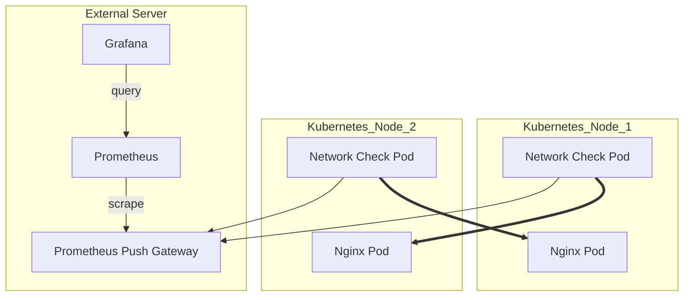

**Network Checker App for Kubernetes** 🌐

This repository contains a simple application designed to check network connectivity within a Kubernetes cluster and
report the information to Prometheus for monitoring purposes. 🚀

### Overview ℹ️

The network checker application is built to monitor network latency and availability between nodes within a Kubernetes
cluster. It periodically tests connectivity between the nginx pods and reports the results to Prometheus using metrics
exposed
through a Pushgateway. 📊



### Features 🛠️

- Periodically checks network connectivity between nodes in the Kubernetes cluster. 🔄
- Reports network latency and availability metrics to Prometheus for monitoring. 📈
- Supports authentication for pushing metrics to the Prometheus Pushgateway. 🔒
- Can be deployed as a DaemonSet in a Kubernetes cluster for easy scalability and monitoring. 🚢

### Prerequisites 📋

- Kubernetes cluster 📦
- Access to Prometheus Pushgateway 🔑

### Deployment 🚀

The project is deployed using Kustomize. Follow these steps:

1. Navigate to the `/manifest` directory.

2. Customize the deployment configurations in the `kustomization.yaml` file to match your environment, including
   Prometheus credentials and other configuration options if necessary.

3. Apply the deployment using Kustomize.

   ```bash
   kubectl apply -k .
   ```

### Configuration ⚙️

- `NAMESPACE`: Namespace in which the network checker application will operate. 📂
- `NETWORK_LATENCY_METRIC`: Name of the Prometheus metric for network latency. 📉
- `NETWORK_AVAILABLE_METRIC`: Name of the Prometheus metric for network availability. 📈
- `PROMETHEUS_PUSHGATEWAY`: URL of the Prometheus Pushgateway. 🚪
- `PROMETHEUS_USERNAME`: Username for authenticating with the Prometheus Pushgateway. 👤
- `PROMETHEUS_PASSWORD`: Password for authenticating with the Prometheus Pushgateway. 🔑

### Usage 🚀

Once deployed, the network checker application will start monitoring network connectivity between nodes in the
Kubernetes
cluster. Metrics will be reported to Prometheus, which can then be visualized and monitored using Prometheus and
Grafana. 📊

Ozeliurs has created a dashboard for the metrics produced by the app, which can be found
at [this URL](https://grafana.com/grafana/dashboards/20707-internal-kubernetes-routes/).

### Contributing 🤝

Contributions to this project are welcome. If you encounter any issues or have suggestions for improvements, please feel
free to open an issue or submit a pull request. 🎉

### License 📄

This project is licensed under the MIT License - see the [LICENSE](LICENSE) file for details. 📜

### Author 🧑‍💻

Appadoo Apoorva Srinivas 🖊️

### Acknowledgements 🙏

- This project was inspired by the need for monitoring network connectivity within Kubernetes clusters. 🌟
- Special thanks to the contributors and maintainers of the libraries and tools used in this project. 🙌

### Support 📧

For any questions or support regarding this project, please contact apoorvappadoo@gmail.com. 📮